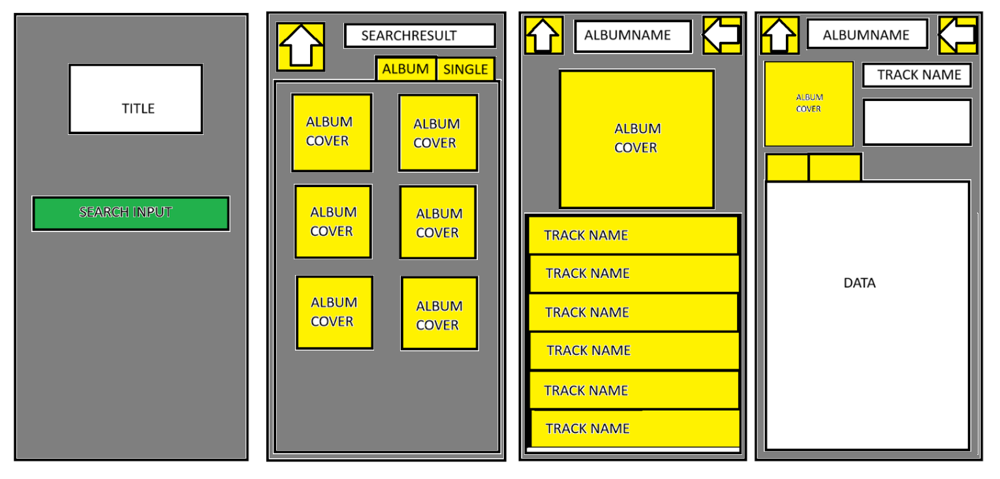

# MusicMetaDB

MusicMetaDB is a modern alternative to MusicBrainz, designed with a mobile-first approach for seamless access on the go. It serves as a comprehensive music metadata database, allowing users to explore detailed information about artists, albums, and tracks. Unlike traditional platforms, MusicMetaDB prioritizes a user-friendly experience with an intuitive interface optimized for smartphones and tablets.

## Project Overview

### Intended Layout

### Purpose
MusicMetaDB aims to provide a simplified and accessible alternative to MusicBrainz. By reducing complexity and focusing on mobile usability, the platform caters to both casual listeners and dedicated music enthusiasts. 

### Intended Users
- **Music fanatics** seeking in-depth metadata
- **Casual listeners** looking for quick and easy access to album details
- **Developers** who need a reliable source of music metadata

### Key Features
- **Comprehensive album information**: Users can search for and explore details about albums, including track listings, durations, and cover art.
- **Mobile-first design**: Optimized for seamless browsing on smartphones and tablets.
- **User-friendly interface**: Simplified navigation compared to existing databases like MusicBrainz.
- **Interactive search functionality**: Users enter a search query, receive a list of clickable album covers, and can view detailed metadata upon selection.

### Data Handling
- **Input:** Users enter a search query.
- **Processing:** The system retrieves relevant albums from the database.
- **Output:** A list of clickable album covers that lead to detailed album metadata, including track names, durations, and artist information.

For additional details on database structure and queries, refer to the [DB LAYOUT](DBLAYOUT.md).

