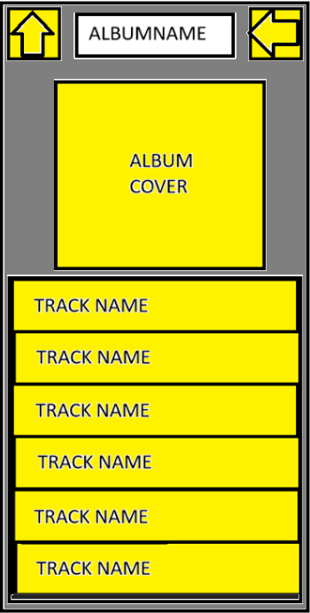

# Low Priority Task for MuscMETA

## Table of Contents

## Implementing the `trackList.ejs`

In the current iteration of the MuscMETA, there was not been an implementation for Album that have more than one track.

The ideal image look should have this 

